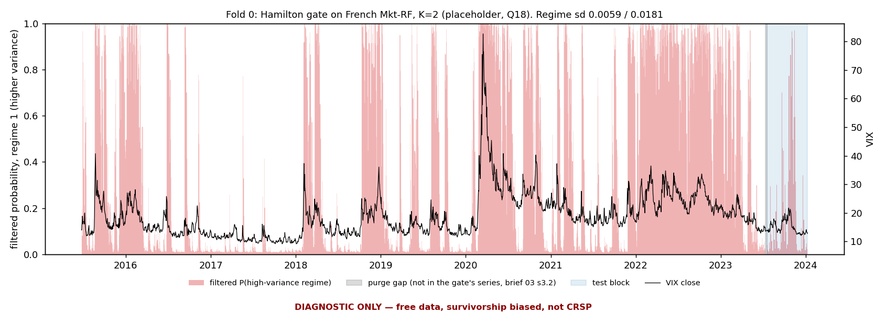
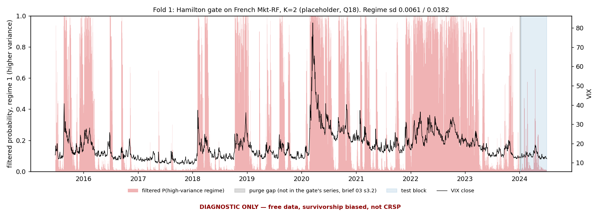
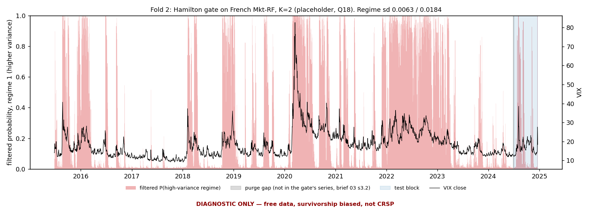
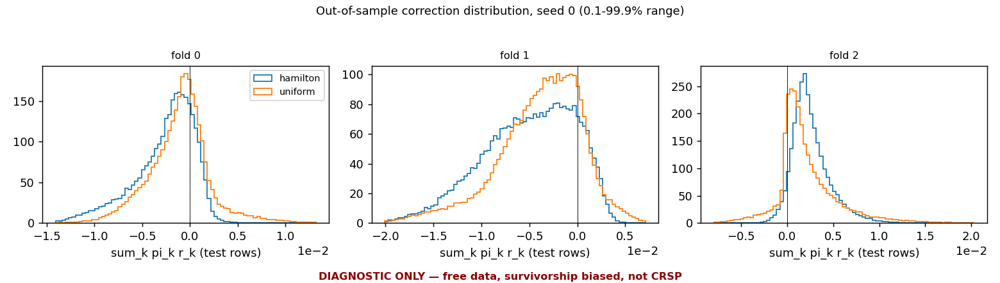

# Smoke run 2026-09-25: first end-to-end run on real data (brief 04 C)

> **DIAGNOSTIC ONLY — free data, survivorship biased, not CRSP.** Nothing in this document may be quoted. This is an integration run, not an experiment: it checks that the pipeline behaves sensibly when the Hamilton gate meets real returns, and how long it takes. No setting was changed in response to anything below.

## 1. What was run

- **K = 2 is a placeholder for plumbing, not a decision; Q18 is open.**
- **Objective `mixture_nll` is the only one registered, not a decision; Q20 is open.**
- Data: `pit_panel_2015_2024.pt` (offline; nothing downloaded). 1,089,688 rows, 2390 dates 2015-06-25 to 2024-12-20, 573 distinct entities; target `fwd_ret_5d` = log(C_{t+5}/C_t).
- Source recorded on every trial row: free: yfinance daily bars for the S&P 500 point-in-time membership union (Wikipedia), 2015-2024, prebuilt pit_panel_2015_2024.pt; departed names missing at the free source (survivorship biased); gate series Kenneth French daily Mkt-RF; VIX from CBOE. NOT CRSP.
- Registry: `nec_baseline/results/smoke_2026_09/trials.jsonl`, every row tagged `smoke_2026_09` with `source` in its config.
- Gate series: market excess return as registered (`market_excess_return`, French daily Mkt-RF aligned by date label). Hamilton `MarkovRegression`, switching mean and variance, fitted per fold on the training block only, frozen, applied causally with `filter(params)`; filtered, never smoothed. Starts `informed_jitter`: quantiles (0.5, 0.75), windows (20, 60), persistences (0.95, 0.99), 3 draws per centre, relative jitter 0.1.
- Residual mixture: base on, `correction_mode=True`, `zero_init_head=True`, gate frozen (`freeze_gate=True`), so only the experts train. Base (64, 32), 1000 steps, batch 128, lr 0.001; experts (64, 32), dropout 0.05, 300 steps per fold, lr 0.001, batch 256; sigma_init 0.04712 (auto: std of the base residual on fold 0's training block, run_experiment's documented default).
- Walk-forward: 3 folds x 120 test dates, purge 5 dates (= horizon), seeds [0, 1]. One `BaseCache` shared by every arm.
- Arms: (1) base only; (2) residual mixture, Hamilton gate; (3) residual mixture, frozen uniform gate (same capacity, no regime information).
- C.5 stop thresholds: stationary probability < 0.02, expected duration < 2.0 days, improvement over the base > 0.05 mean rank IC (checked pooled and per fold). Gate non-convergence read as: no start converged on a fold (the fit raises); individual non-converged starts are reported, not a stop.

Fold spans:

*DIAGNOSTIC ONLY — free data, survivorship biased, not CRSP.*

| fold | fitted (train) dates | purge | test dates |
|---|---|---|---|
| 0 | 2015-06-25 to 2023-07-12 (2025) | 5 | 2023-07-20 to 2024-01-09 (120) |
| 1 | 2015-06-25 to 2024-01-02 (2145) | 5 | 2024-01-10 to 2024-07-02 (120) |
| 2 | 2015-06-25 to 2024-06-25 (2265) | 5 | 2024-07-03 to 2024-12-20 (120) |

## 2. The gate, per fold

Canonical order: regime 0 has the lower variance. The fit is deterministic (fixed `start_seed`), so the gate is the same for both seeds; the script fits it once before any expert trains (to check C.5 first) and then checks that the harness's own fit reproduced it exactly.

*DIAGNOSTIC ONLY — free data, survivorship biased, not CRSP.*

| fold | mean (daily, 0 / 1) | variance (0 / 1) | sd (0 / 1) | expected duration, days (0 / 1) | stationary prob (0 / 1) | log-lik | permutation applied |
|---|---|---|---|---|---|---|---|
| 0 | +0.00124 / -0.00077 | 3.466e-05 / 3.282e-04 | 0.0059 / 0.0181 | 48.5 / 30.2 | 0.616 / 0.384 | 6521.62 | [0, 1] |
| 1 | +0.00115 / -0.00078 | 3.758e-05 / 3.315e-04 | 0.0061 / 0.0182 | 54.7 / 30.3 | 0.644 / 0.356 | 6924.47 | [0, 1] |
| 2 | +0.00111 / -0.00081 | 4.008e-05 / 3.396e-04 | 0.0063 / 0.0184 | 66.9 / 32.0 | 0.676 / 0.324 | 7345.32 | [0, 1] |

Transition matrices (row-stochastic, canonical order; row = from):

*DIAGNOSTIC ONLY — free data, survivorship biased, not CRSP.*

| fold | p(0->0) | p(0->1) | p(1->0) | p(1->1) |
|---|---|---|---|---|
| 0 | 0.9794 | 0.0206 | 0.0331 | 0.9669 |
| 1 | 0.9817 | 0.0183 | 0.0330 | 0.9670 |
| 2 | 0.9850 | 0.0150 | 0.0312 | 0.9688 |

Multi-start record (brief 04 B.3):

*DIAGNOSTIC ONLY — free data, survivorship biased, not CRSP.*

| fold | starts | converged | failed (raised) | non-converged | distinct optima | best minus second (nats) | gate fit, s |
|---|---|---|---|---|---|---|---|
| 0 | 24 | 24 | 0 | 0 | 1 | n/a (one optimum) | 4.6 |
| 1 | 24 | 24 | 0 | 0 | 1 | n/a (one optimum) | 4.5 |
| 2 | 24 | 24 | 0 | 0 | 1 | n/a (one optimum) | 4.5 |

Filtered probability of the high-variance regime against VIX. Spearman rank correlation between the two, on the fitted dates and on the test dates separately (a sanity check on the split, not a performance number):

*DIAGNOSTIC ONLY — free data, survivorship biased, not CRSP.*

| fold | rho(P_high, VIX) fitted | rho(P_high, VIX) test | share of fitted dates P_high > 0.5 | share of test dates P_high > 0.5 |
|---|---|---|---|---|
| 0 | +0.810 | +0.627 | 0.388 | 0.142 |
| 1 | +0.808 | +0.658 | 0.357 | 0.017 |
| 2 | +0.808 | +0.410 | 0.326 | 0.275 |

The harness applies the frozen filter over the training dates followed directly by the test dates, as brief 03 section 3.2 specifies ("construct the model over train plus test"). The purge-gap market returns are therefore not in the filtered series, and one transition step bridges the gap. The same frozen fit run over the contiguous span, gap included, measures what that does to the test block (see Observations):

*DIAGNOSTIC ONLY — free data, survivorship biased, not CRSP.*

| fold | max abs dP_high over test dates | abs dP_high on the first test date | test dates with abs dP_high > 1e-3 |
|---|---|---|---|
| 0 | 7.05e-03 | 7.05e-03 | 2 |
| 1 | 7.88e-03 | 7.88e-03 | 2 |
| 2 | 4.33e-04 | 4.33e-04 | 0 |

## 3. The arms

The base's IC is identical in every arm of a (seed, fold) because the base is shared; the base's NLL is not, because it is evaluated with each mixture's own noise scale (brief 02 section 5), so it is listed per arm. Correction = `sum_k pi_k r_k` on the test rows; pairwise distance = RMS distance between the two experts' corrections `r_0, r_1` on the test rows.

### Seed 0

Rank IC (mean over test dates) and ICIR (mean / sd of the daily IC):

*DIAGNOSTIC ONLY — free data, survivorship biased, not CRSP.*

| arm | fold | mean rank IC | ICIR | base mean IC | base ICIR | IC improvement over base |
|---|---|---|---|---|---|---|
| base only | pooled | +0.0065 | +0.056 | — | — | — |
| base only | 0 | +0.0113 | +0.096 | — | — | — |
| base only | 1 | +0.0038 | +0.036 | — | — | — |
| base only | 2 | +0.0044 | +0.036 | — | — | — |
| hamilton | pooled | +0.0025 | +0.030 | +0.0065 | +0.056 | -0.0041 |
| hamilton | 0 | +0.0127 | +0.162 | +0.0113 | +0.096 | +0.0014 |
| hamilton | 1 | -0.0021 | -0.027 | +0.0038 | +0.036 | -0.0059 |
| hamilton | 2 | -0.0033 | -0.035 | +0.0044 | +0.036 | -0.0077 |
| uniform | pooled | +0.0017 | +0.018 | +0.0065 | +0.056 | -0.0048 |
| uniform | 0 | +0.0065 | +0.053 | +0.0113 | +0.096 | -0.0048 |
| uniform | 1 | +0.0007 | +0.009 | +0.0038 | +0.036 | -0.0032 |
| uniform | 2 | -0.0021 | -0.025 | +0.0044 | +0.036 | -0.0065 |

Out-of-sample negative log likelihood per test row (pooled = row-weighted mean of the folds); improvement = base minus mixture, positive means the correction lowered it:

*DIAGNOSTIC ONLY — free data, survivorship biased, not CRSP.*

| arm | fold | NLL | base NLL (same sigma) | NLL improvement |
|---|---|---|---|---|
| hamilton | pooled | -1.7970 | -1.7745 | +0.02253 |
| hamilton | 0 | -1.8086 | -1.7891 | +0.01951 |
| hamilton | 1 | -1.8788 | -1.8588 | +0.01998 |
| hamilton | 2 | -1.7040 | -1.6760 | +0.02806 |
| uniform | pooled | -1.7834 | -1.7686 | +0.01478 |
| uniform | 0 | -1.7948 | -1.7800 | +0.01481 |
| uniform | 1 | -1.8447 | -1.8403 | +0.00443 |
| uniform | 2 | -1.7111 | -1.6860 | +0.02507 |

Correction applied out of sample, pairwise distance between the fitted corrections, and live parameter count:

*DIAGNOSTIC ONLY — free data, survivorship biased, not CRSP.*

| arm | fold | mean abs | sd | q05 / q25 / q50 / q75 / q95 | max abs | mean abs / base sd | pairwise distance r_0 vs r_1 | live params |
|---|---|---|---|---|---|---|---|---|
| hamilton | 0 | 3.023e-03 | 3.208e-03 | -9.202e-03 / -4.323e-03 / -1.922e-03 / -3.285e-04 / 1.360e-03 | 1.556e-02 | 0.6648 | 3.644e-03 | 6146 |
| hamilton | 1 | 5.459e-03 | 4.756e-03 | -1.366e-02 / -8.295e-03 / -4.542e-03 / -1.255e-03 / 1.673e-03 | 2.294e-02 | 1.1833 | 5.628e-03 | 6146 |
| hamilton | 2 | 2.646e-03 | 2.081e-03 | -1.714e-04 / 1.209e-03 / 2.176e-03 / 3.548e-03 / 6.562e-03 | 1.469e-02 | 0.7101 | 2.368e-03 | 6146 |
| uniform | 0 | 2.518e-03 | 3.288e-03 | -6.637e-03 / -2.878e-03 / -8.726e-04 / 5.773e-04 / 4.177e-03 | 1.800e-02 | 0.5539 | 3.109e-02 | 6146 |
| uniform | 1 | 4.456e-03 | 4.439e-03 | -1.243e-02 / -6.342e-03 / -3.261e-03 / -6.934e-04 / 2.214e-03 | 2.276e-02 | 0.9661 | 2.803e-02 | 6146 |
| uniform | 2 | 2.687e-03 | 3.386e-03 | -2.176e-03 / 2.703e-04 / 1.345e-03 / 3.348e-03 / 8.586e-03 | 2.577e-02 | 0.7210 | 3.404e-02 | 6146 |

### Seed 1

Rank IC (mean over test dates) and ICIR (mean / sd of the daily IC):

*DIAGNOSTIC ONLY — free data, survivorship biased, not CRSP.*

| arm | fold | mean rank IC | ICIR | base mean IC | base ICIR | IC improvement over base |
|---|---|---|---|---|---|---|
| base only | pooled | +0.0137 | +0.135 | — | — | — |
| base only | 0 | +0.0256 | +0.287 | — | — | — |
| base only | 1 | +0.0230 | +0.246 | — | — | — |
| base only | 2 | -0.0076 | -0.064 | — | — | — |
| hamilton | pooled | +0.0117 | +0.135 | +0.0137 | +0.135 | -0.0020 |
| hamilton | 0 | +0.0181 | +0.196 | +0.0256 | +0.287 | -0.0075 |
| hamilton | 1 | +0.0108 | +0.143 | +0.0230 | +0.246 | -0.0123 |
| hamilton | 2 | +0.0063 | +0.068 | -0.0076 | -0.064 | +0.0139 |
| uniform | pooled | +0.0069 | +0.072 | +0.0137 | +0.135 | -0.0068 |
| uniform | 0 | +0.0137 | +0.145 | +0.0256 | +0.287 | -0.0118 |
| uniform | 1 | +0.0148 | +0.172 | +0.0230 | +0.246 | -0.0083 |
| uniform | 2 | -0.0079 | -0.077 | -0.0076 | -0.064 | -0.0003 |

Out-of-sample negative log likelihood per test row (pooled = row-weighted mean of the folds); improvement = base minus mixture, positive means the correction lowered it:

*DIAGNOSTIC ONLY — free data, survivorship biased, not CRSP.*

| arm | fold | NLL | base NLL (same sigma) | NLL improvement |
|---|---|---|---|---|
| hamilton | pooled | -1.7973 | -1.7778 | +0.01947 |
| hamilton | 0 | -1.8078 | -1.7954 | +0.01242 |
| hamilton | 1 | -1.8792 | -1.8623 | +0.01686 |
| hamilton | 2 | -1.7053 | -1.6763 | +0.02909 |
| uniform | pooled | -1.7783 | -1.7709 | +0.00746 |
| uniform | 0 | -1.7826 | -1.7835 | -0.00087 |
| uniform | 1 | -1.8394 | -1.8423 | -0.00284 |
| uniform | 2 | -1.7132 | -1.6872 | +0.02599 |

Correction applied out of sample, pairwise distance between the fitted corrections, and live parameter count:

*DIAGNOSTIC ONLY — free data, survivorship biased, not CRSP.*

| arm | fold | mean abs | sd | q05 / q25 / q50 / q75 / q95 | max abs | mean abs / base sd | pairwise distance r_0 vs r_1 | live params |
|---|---|---|---|---|---|---|---|---|
| hamilton | 0 | 1.136e-03 | 1.378e-03 | -2.354e-03 / -2.310e-04 / 6.249e-04 / 1.273e-03 / 2.173e-03 | 8.492e-03 | 0.3582 | 2.043e-03 | 6146 |
| hamilton | 1 | 3.366e-03 | 4.157e-03 | -5.533e-03 / -3.279e-03 / -3.430e-04 / 2.791e-03 / 7.407e-03 | 2.069e-02 | 0.7544 | 5.420e-03 | 6146 |
| hamilton | 2 | 1.249e-03 | 1.783e-03 | -1.292e-03 / -5.791e-04 / -1.772e-04 / 1.285e-03 / 4.352e-03 | 1.189e-02 | 0.3705 | 3.056e-03 | 6146 |
| uniform | 0 | 2.274e-03 | 2.104e-03 | -2.922e-03 / 8.236e-04 / 1.935e-03 / 2.774e-03 / 4.060e-03 | 1.297e-02 | 0.7170 | 3.949e-02 | 6146 |
| uniform | 1 | 3.319e-03 | 4.187e-03 | -4.214e-03 / -2.419e-03 / -5.603e-05 / 3.497e-03 / 8.976e-03 | 2.142e-02 | 0.7439 | 3.307e-02 | 6146 |
| uniform | 2 | 1.268e-03 | 1.975e-03 | -3.319e-03 / -7.077e-04 / -7.843e-05 / 7.867e-04 / 2.960e-03 | 1.497e-02 | 0.3762 | 2.904e-02 | 6146 |

Base-only arm: the base network has 3,073 parameters, all trained in its own fit and frozen before the experts train.

Live parameter count is the gradient audit's snapshot at the first backward pass: the encoder, gate and prior are frozen, and `log_sigma` is still held by the 100-step sigma freeze at that instant, so the count is the expert networks (brief 02 section 5 reads it this way).

## 4. Timing

Wall clock per fold, seconds. The harness times gate fit, base fit and expert training separately. A base-fit time near zero is a `BaseCache` hit: the real base cost of a (seed, fold) is its one cache miss, in the second table (fold 0 of seed 0 was fitted by the sigma probe before the arms: 0.6 s).

*DIAGNOSTIC ONLY — free data, survivorship biased, not CRSP.*

| arm | seed | fold | gate fit | base fit | expert training | total |
|---|---|---|---|---|---|---|
| hamilton | 0 | 0 | 4.2 | 0.0 | 0.9 | 5.1 |
| hamilton | 0 | 1 | 4.2 | 0.2 | 0.9 | 5.3 |
| hamilton | 0 | 2 | 4.3 | 0.2 | 0.9 | 5.4 |
| uniform | 0 | 0 | 0.0 | 0.0 | 0.8 | 0.8 |
| uniform | 0 | 1 | 0.0 | 0.0 | 0.8 | 0.8 |
| uniform | 0 | 2 | 0.0 | 0.0 | 0.8 | 0.8 |
| hamilton | 1 | 0 | 4.0 | 0.2 | 0.9 | 5.1 |
| hamilton | 1 | 1 | 4.2 | 0.2 | 0.9 | 5.3 |
| hamilton | 1 | 2 | 4.3 | 0.2 | 0.9 | 5.4 |
| uniform | 1 | 0 | 0.0 | 0.0 | 0.8 | 0.8 |
| uniform | 1 | 1 | 0.0 | 0.0 | 0.8 | 0.8 |
| uniform | 1 | 2 | 0.0 | 0.0 | 0.8 | 0.8 |

*DIAGNOSTIC ONLY — free data, survivorship biased, not CRSP.*

| seed | fold | base fit (cache miss), s |
|---|---|---|
| 0 | 0 | 0.6 |
| 0 | 1 | 0.2 |
| 0 | 2 | 0.2 |
| 1 | 0 | 0.2 |
| 1 | 1 | 0.2 |
| 1 | 2 | 0.2 |

Total wall clock of the script: 72 s. Environment: Python 3.14.4, torch 2.12.1, statsmodels 0.14.6, arm64, 10 torch threads, CPU.

## 5. Observations

Anything that looks wrong or surprising. No interpretation of performance.

*DIAGNOSTIC ONLY — free data, survivorship biased, not CRSP.* Nothing below is a finding about
performance, and no setting was changed after reading any of it.

1. **No C.5 stop condition fired.** Every fold's gate converged; the smallest stationary
   probability is 0.324 and the shortest expected duration 30.2 days (thresholds 0.02 and 2 days);
   the largest improvement over the base in mean rank IC, pooled or per fold, is +0.0139 (threshold
   0.05). Every |mean rank IC| in the run is at most 0.026, so nothing looks implausibly strong for
   a real cross-sectional signal.
2. **The multimodality that B.1 anticipated did not appear on this series.** All 24 starts
   converged on every fold, none raised, and all found one optimum (to within 1 nat). The three fits
   are close to each other, as expected from nested windows that overlap by more than 89%. The calm
   regime's expected duration lengthens from 48.5 to 54.7 to 66.9 days as the window extends into
   2023 and 2024.
3. **The calm/turbulent split lines up with VIX.** On the fitted dates the high-variance regime
   covers the episodes visible in VIX: 2015 to 2016, February 2018, late 2018, March to June 2020,
   and 2022 (Spearman 0.81 on every fold). It also switches on intermittently in 2021, when VIX is
   moderate (around 20 to 30). On the test blocks the correlation is lower (0.41 to 0.66).
4. **The test blocks sit mostly in the calm regime.** The filtered P(high variance) exceeds 0.5 on
   17, 2 and 33 of the 120 test dates of folds 0, 1 and 2. On fold 1 the Hamilton prior puts the calm
   regime above 0.5 on all but two test dates. There the Hamilton and uniform arms differ mainly in
   their mixing weights, not in regime variation. This period tests the high-variance regime very little.
5. **The gate's filter skips the purge gap (found by this run's consistency check).** The harness
   builds the model over the training dates followed directly by the test dates, which is what
   brief 03 section 3.2 specifies ("train plus test"). The five purge-gap market returns are
   therefore not in the filtered series, and a single transition step bridges six trading days.
   This is not leakage: it uses less information than was available, not more. The market returns
   in the gap are known before the first test date, and the gate never touches labels. Measured
   against the same frozen fit filtered over the contiguous span, P(high variance) differs by at most
   7.9e-3, on the first test date, and by more than 1e-3 on at most two test dates per fold. Whether
   "train plus test" should mean the contiguous span is the author's call. It is left as specified,
   because changing it is outside brief 04.
6. **The corrections are not small next to the base.** The mean |correction| is 0.36 to 1.18 times
   the standard deviation of the base's own predictions. The base's predictions are themselves
   narrow: sd about 0.003 to 0.005, against a target sd of about 0.046.
7. **Much of the correction is a common shift within a fold.** In seed 0 at least three quarters of
   the Hamilton arm's corrections have one sign on every fold (negative on folds 0 and 1, positive
   on fold 2). The same holds in 3 of the 6 uniform-arm cells. A shift that is common to all names on
   a date leaves the per-date rank IC unchanged but changes the NLL. In this run the two metrics
   therefore respond to different parts of the correction, which is worth keeping in mind whichever
   objective Q20 settles on.
8. **Under the uniform gate the two experts' corrections are large and nearly cancel.** The RMS
   distance between r_0 and r_1 is 0.028 to 0.039 in the uniform arm, against 0.002 to 0.006 in the
   Hamilton arm. Yet the applied correction, (r_0 + r_1)/2, has a mean |.| of only 1.3e-3 to 4.5e-3.
   So each r_k is roughly ±0.015, about a third of the target's sd, with the two in opposite
   directions. That fits the note under Q20: under the likelihood, experts are separated through the
   posterior, which sees the realised target, even when the prior carries no regime information.
   Out of sample only the prior weights them, and the separation averages out.
9. **The base itself moves between seeds by as much as any arm moves from the base.** The base's
   mean rank IC differs between seeds by up to 0.019 on a fold (fold 1: 0.0038 against 0.0230), and
   changes sign on fold 2. Every arm-minus-base difference in the tables is at most 0.014 in absolute
   value.
10. **Training length.** At these settings the base's 1,000 steps of 128 rows cover under a fifth of
    one pass over its training split. The experts' 300 steps of 256 rows cover under a tenth of a
    pass over the training block. The step count was fixed before the run as C.2's "modest step
    count" and is recorded here, not changed. `sigma_init` (0.0471, the sd of the base residual on
    fold 0's training block) is about the target's own sd.
11. **Timing (for Q11).** The gate fit is the largest cost per Hamilton fold: 4.0 to 4.3 s of 5.1
    to 5.4 s for 24 starts on 2,025 to 2,265 dates. The base took 0.2 s per fit (after 0.6 s for the
    first, which includes warm-up) and the experts 0.8 to 0.9 s. Base and expert costs grow in
    proportion to steps, which here are far below one pass, so this split does not carry over to a
    run trained to convergence. The whole script took 72 s.
12. **Capacity of the control.** The live parameter count is 6,146 in both mixture arms, which is
    2 × 3,073: each expert has the base's architecture. That confirms C.3's "identical capacity" for
    the uniform control. `log_sigma` is not counted because it is frozen at the audit snapshot.
13. **The registry double-counts the gate's starts.** Each seed's Hamilton run logs its fold's 24
    starts, so the tag holds 144 gate-start rows for 72 distinct starts. The fit is identical across
    seeds (checked below). Any multiplicity count taken from this tag should divide these rows by the
    number of seeds.
14. **Data use.** As brief 04 instructs, the run evaluated on the free panel's last 360 dates (2023-07-20
    to 2024-12-20). Those dates of the free panel have now been looked at. CRSP was not touched. The
    WORK_QUEUE rule on out-of-sample data (blocked on the pre-registration and Q20) is noted so the
    author can decide whether this affects later protocol choices on the free panel.

Automatic checks (by construction these must hold):

- The base IC is identical across arms in every (seed, fold): the base was shared.
- The harness's gate reproduced the pre-flight gate exactly (log-likelihood and the whole filtered-probability table) in every (seed, fold).

---

*DIAGNOSTIC ONLY — free data, survivorship biased, not CRSP.* Generated by `nec_baseline/scripts/smoke_run_2026_09.py` at commit `1b7561e + uncommitted nec_moe changes`.
