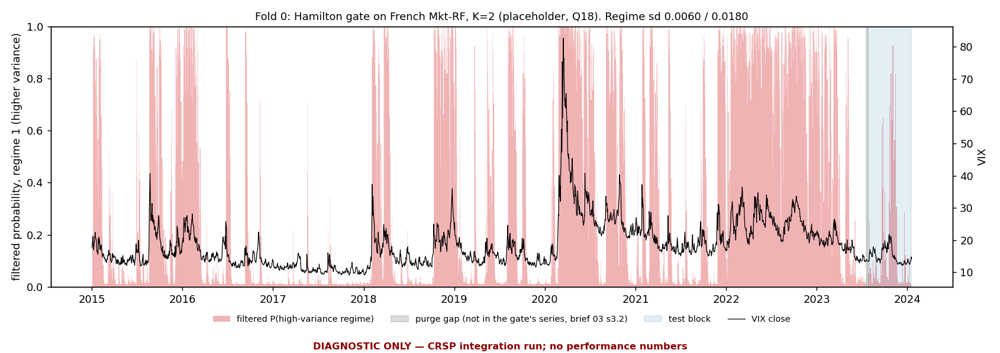
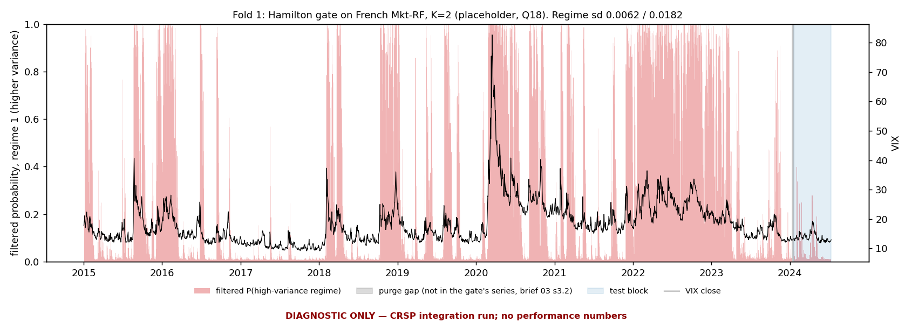
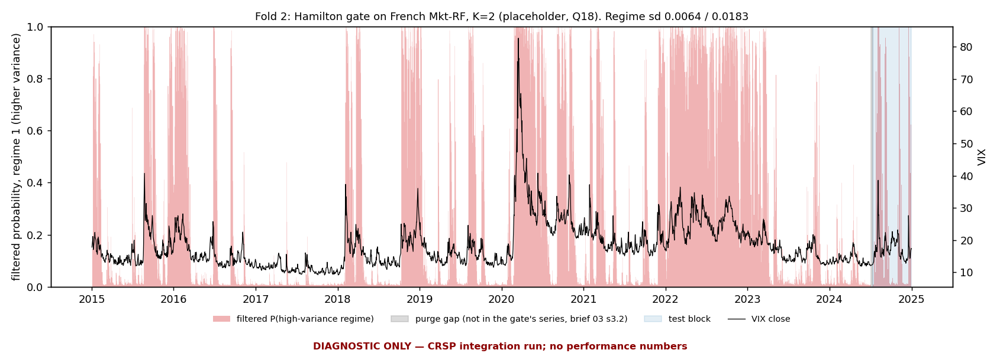

# Smoke run 2026-09-26 on CRSP: integration check (brief 06 F)

> **DIAGNOSTIC ONLY — CRSP integration run; no performance numbers.** The brief 04 C smoke run repeated with only the data source changed, to confirm the pipeline runs end to end on CRSP. This report holds only data statistics, the gate per fold, whether the experts trained, and the wall clock. **No out-of-sample performance number is reported** (no IC, ICIR, NLL or NLL gain, pooled or per fold): the pre-registration is not written yet (WORK_QUEUE item 8, Q15). The harness computed them; they stay in the registry under `Data/derived/`, unread.

## 1. Run

Settings of brief 04 C, unchanged: K = 2 (placeholder, Q18), objective `mixture_nll` (Q20), base on, `correction_mode`, `zero_init_head`, frozen gate; Hamilton gate on French daily Mkt-RF (`market_excess_return`), starts `informed_jitter`; 3 folds x 120 test dates, purge 5 (= horizon 5); seeds [0, 1]; 300 expert steps per fold; arms: Hamilton-gated and uniform-gated residual mixtures over one shared base. Data: `pit_panel_crsp_2015-01-01_2024-12-31.pt`. Every registry row carries `data_source` = `crsp_ciz202512`, `post_delisting_return` = `cash` and `hidden_init`.

*DIAGNOSTIC ONLY — CRSP integration run; no performance numbers.*

| fold | fitted (train) dates | purge | test dates |
|---|---|---|---|
| 0 | 2015-01-02 to 2023-07-20 (2151) | 5 | 2023-07-28 to 2024-01-18 (120) |
| 1 | 2015-01-02 to 2024-01-10 (2271) | 5 | 2024-01-19 to 2024-07-11 (120) |
| 2 | 2015-01-02 to 2024-07-03 (2391) | 5 | 2024-07-12 to 2024-12-31 (120) |

## 2. Data

- Release `ciz202512`; universe: S&P 500 membership spells of INDNO 1000500 (bounds inclusive); market series INDNO 1000500, `log(1 + DlyTotRet)`.
- Rows: 1,264,598; dates: 2516 (2015-01-02 to 2024-12-31); PERMNOs with rows: 713 of 736 ever-members.
- Index members per date: min 502, median 505, max 508 (band 500 to 510: inside). Panel rows per date: min 495, median 503, max 505. Dual-class companies (one PERMCO, two member PERMNOs) are kept as two PERMNOs: 7 such companies, 2 to 6 on any date.

Coverage by year (members during the year, and those with at least one panel row; a member without rows lacks the feature warm-up or usable returns in that year):

*DIAGNOSTIC ONLY — CRSP integration run; no performance numbers.*

| year | members | with rows | without rows | coverage |
|---|---|---|---|---|
| 2015 | 531 | 527 | 4 | 0.992 |
| 2016 | 543 | 534 | 9 | 0.983 |
| 2017 | 534 | 531 | 3 | 0.994 |
| 2018 | 533 | 527 | 6 | 0.989 |
| 2019 | 529 | 527 | 2 | 0.996 |
| 2020 | 523 | 520 | 3 | 0.994 |
| 2021 | 524 | 523 | 1 | 0.998 |
| 2022 | 522 | 521 | 1 | 0.998 |
| 2023 | 521 | 517 | 4 | 0.992 |
| 2024 | 520 | 519 | 1 | 0.998 |

- Delistings inside the window: 104 of stocks that were S&P 500 members on their last trading day (MER 100, GDR 3, GEX 1).
- Delisting finding (A.4.2): CIZ `DlyRet` already includes the delisting return (`MetaSIZtoCIZ` maps legacy `DLRET` to both `DelRet` and `DlyRet`). In the extract, all 134 of 134 delisting-return rows match their delisting record; `DlyRet` equals `DelRet` on 132 and both are missing on 2. So nothing is compounded in (rule a). 2 member delistings have no delisting return (GDR/FING: 2; DelActionType/DelReasonType): their targets stay missing, nothing is imputed. Forward windows past a delisting are completed with the post-delisting fill (`cash`, not a decision); it touched 407 panel rows.

## 3. The gate, per fold

Canonical order: regime 0 has the lower variance. Fitted on each fold's training block only, frozen, applied causally (filtered, never smoothed). Convergence and the multi-start record (brief 04 B.3):

*DIAGNOSTIC ONLY — CRSP integration run; no performance numbers.*

| fold | starts | converged | failed (raised) | non-converged | distinct optima | best minus second (nats) | stationary prob (0 / 1) | expected duration, days (0 / 1) |
|---|---|---|---|---|---|---|---|---|
| 0 | 24 | 24 | 0 | 0 | 1 | n/a (one optimum) | 0.630 / 0.370 | 53.9 / 31.7 |
| 1 | 24 | 24 | 0 | 0 | 1 | n/a (one optimum) | 0.657 / 0.343 | 61.4 / 32.0 |
| 2 | 24 | 24 | 0 | 0 | 1 | n/a (one optimum) | 0.682 / 0.318 | 71.8 / 33.5 |

Stop thresholds (brief 06 F): no start converged; a stationary probability below 0.02; an expected duration below 2.0 days.

Filtered probability of the high-variance regime against VIX: Spearman rank correlation on the fitted and on the test dates (a sanity check of the regimes, not a performance number):

*DIAGNOSTIC ONLY — CRSP integration run; no performance numbers.*

| fold | rho(P_high, VIX) fitted | rho(P_high, VIX) test |
|---|---|---|
| 0 | +0.811 | +0.620 |
| 1 | +0.809 | +0.672 |
| 2 | +0.809 | +0.320 |

## 4. Experts

*DIAGNOSTIC ONLY — CRSP integration run; no performance numbers.*

| arm | seed | folds trained | steps per fold | live parameters |
|---|---|---|---|---|
| hamilton | 0 | 3 / 3 | 300 | 6146 |
| uniform | 0 | 3 / 3 | 300 | 6146 |
| hamilton | 1 | 3 / 3 | 300 | 6146 |
| uniform | 1 | 3 / 3 | 300 | 6146 |

Live parameters: the gradient audit's count at the first backward pass (encoder, gate and prior frozen; `log_sigma` held by the sigma freeze at that instant), i.e. the expert networks.

Automatic checks passed: every arm of a (seed, fold) used the same fitted base, and the harness's gate reproduced the pre-flight gate exactly (log-likelihood and the whole filtered-probability table).

## 5. Wall clock per fold (seconds)

Gate fit, base fit and expert training, as the harness times them. A base fit near zero is a `BaseCache` hit; each (seed, fold)'s real base cost is its one cache miss, in the second table (the sigma probe fitted fold 0 of seed 0 before the arms: 0.6 s).

*DIAGNOSTIC ONLY — CRSP integration run; no performance numbers.*

| arm | seed | fold | gate fit | base fit | expert training | total |
|---|---|---|---|---|---|---|
| hamilton | 0 | 0 | 4.2 | 0.0 | 1.0 | 5.2 |
| hamilton | 0 | 1 | 4.3 | 0.2 | 0.9 | 5.4 |
| hamilton | 0 | 2 | 4.5 | 0.2 | 0.9 | 5.7 |
| uniform | 0 | 0 | 0.0 | 0.0 | 0.8 | 0.8 |
| uniform | 0 | 1 | 0.0 | 0.0 | 0.8 | 0.8 |
| uniform | 0 | 2 | 0.0 | 0.0 | 0.8 | 0.8 |
| hamilton | 1 | 0 | 4.2 | 0.2 | 0.9 | 5.4 |
| hamilton | 1 | 1 | 4.3 | 0.2 | 0.9 | 5.4 |
| hamilton | 1 | 2 | 4.5 | 0.2 | 0.9 | 5.7 |
| uniform | 1 | 0 | 0.0 | 0.0 | 0.8 | 0.8 |
| uniform | 1 | 1 | 0.0 | 0.0 | 0.8 | 0.8 |
| uniform | 1 | 2 | 0.0 | 0.0 | 0.8 | 0.9 |

*DIAGNOSTIC ONLY — CRSP integration run; no performance numbers.*

| seed | fold | base fit (cache miss), s |
|---|---|---|
| 0 | 0 | 0.6 |
| 0 | 1 | 0.2 |
| 0 | 2 | 0.2 |
| 1 | 0 | 0.2 |
| 1 | 1 | 0.2 |
| 1 | 2 | 0.2 |

Total wall clock of the script: 75 s. Environment: Python 3.14.4, torch 2.12.1, statsmodels 0.14.6, arm64, 10 torch threads, CPU.

---

*DIAGNOSTIC ONLY — CRSP integration run; no performance numbers.* Generated by `nec_baseline/scripts/smoke_run_2026_09.py --crsp` at commit `6dd3276`.
